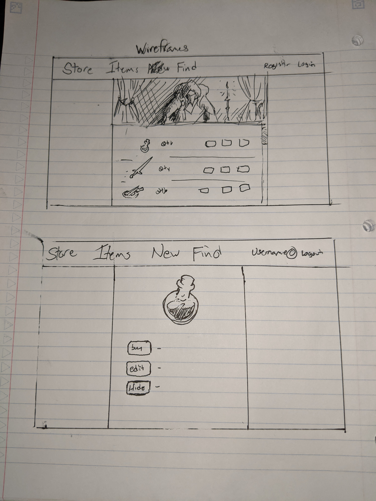

<div id="top"></div>

[![Contributors][contributors-shield]][contributors-url]
[![Forks][forks-shield]][forks-url]
[![Stargazers][stars-shield]][stars-url]
[![Issues][issues-shield]][issues-url]
[![MIT License][license-shield]][license-url]
[![LinkedIn][linkedin-shield]][linkedin-url]


<!-- PROJECT LOGO -->
<br />
<div align="center">
  <a href="https://github.com/nicholastonelli/dnd_store">
    
  </a>

<h3 align="center">Dnd_Store</h3>

  <p align="center">
   An express node app database for generating magic items and magic items shops for dnd5e
    <br />
    <a href="https://github.com/nicholastonelli/dnd_store"><strong>Explore the docs »</strong></a>
    <br />
    <br />
    <a href="https://github.com/nicholastonelli/dnd_store">View Demo</a>
    ·
    <a href="https://github.com/nicholastonelli/dnd_store/issues">Report Bug</a>
    ·
    <a href="https://github.com/nicholastonelli/dnd_store/issues">Request Feature</a>
  </p>
</div>


<!-- TABLE OF CONTENTS -->
<details>
  <summary>Table of Contents</summary>
  <ol>
    <li>
      <a href="#about-the-project">About The Project</a>
      <ul>
        <li><a href="#built-with">Built With</a></li>
      </ul>
    </li>
    <li>
      <a href="#getting-started">Getting Started</a>
      <ul>
        <li><a href="#prerequisites">Prerequisites</a></li>
        <li><a href="#installation">Installation</a></li>
      </ul>
    </li>
    <li><a href="#usage">Usage</a></li>
    <li><a href="#roadmap">Roadmap</a></li>
    <li><a href="#contributing">Contributing</a></li>
    <li><a href="#license">License</a></li>
    <li><a href="#contact">Contact</a></li>
    <li><a href="#userstories">User Stories</a></li>
  </ol>
</details>


<!-- ABOUT THE PROJECT -->
## About The Project

[![Product Name Screen Shot][product-screenshot]](https://example.com)

This is a Dungeons and Dragons 5e items database. Add homebrew, make items, generate stores.

<p align="right">(<a href="#top">back to top</a>)</p>


### Built With

* [Node, Express, EJS, express-ejs-layouts, MongoDB, Mongoose]

<p align="right">(<a href="#top">back to top</a>)</p>


<!-- GETTING STARTED -->
## Getting Started

Fork this repo or open <a href='https://nicholastonelli.github.io/dnd_store/'>here</a>.


### Installation


1. Clone the repo
   ```sh
   git clone https://github.com/nicholastonelli/dnd_store.git
   ```

<p align="right">(<a href="#top">back to top</a>)</p>


<!-- USAGE EXAMPLES -->
## Usage

Use this project as a resource in your D&D5E games, or as a reference tool for items and statistics in the OGL, or to find Homebrew Items submitted by our users.


<p align="right">(<a href="#top">back to top</a>)</p>


<!-- ROADMAP -->
## Roadmap

- [] Linking Users to submitted data
- [] Matched 5e Styling
- [] Outfitting Player Character form

See the [open issues](https://github.com/nicholastonelli/dnd_store/issues) for a full list of proposed features (and known issues).

<p align="right">(<a href="#top">back to top</a>)</p>


<!-- CONTRIBUTING -->
## Contributing

Contributions are what make the open source community such an amazing place to learn, inspire, and create. Any contributions you make are **greatly appreciated**.

If you have a suggestion that would make this better, please fork the repo and create a pull request. You can also simply open an issue with the tag "enhancement".
Don't forget to give the project a star! Thanks again!

1. Fork the Project
2. Create your Feature Branch (`git checkout -b feature/AmazingFeature`)
3. Commit your Changes (`git commit -m 'Add some AmazingFeature'`)
4. Push to the Branch (`git push origin feature/AmazingFeature`)
5. Open a Pull Request

<p align="right">(<a href="#top">back to top</a>)</p>


<!-- LICENSE -->
## License

Distributed under the OGL and SRD License. See `LICENSE.txt` for more information.

<p align="right">(<a href="#top">back to top</a>)</p>


<!-- CONTACT -->
## Contact

Nicholas Tonelli- nicholasevantonelli@gmail.com

Project Link: [https://github.com/nicholastonelli/dnd_store](https://github.com/nicholastonelli/dnd_store)

<p align="right">(<a href="#top">back to top</a>)</p>

<!-- USER STORIES -->
## User Stories

* As a user, I should be able to create new magic items, and add homebrew items to the database.
* As a user, I should be able to generate a magic item store based on several parameters, such as maximum rarity, item type, and shop size. 

<p align="right">(<a href="#top">back to top</a>)</p>

<!-- WIREFRAMES -->
## Wireframes



<p align="right">(<a href="#top">back to top</a>)</p>


<!-- MARKDOWN LINKS & IMAGES -->
<!-- https://www.markdownguide.org/basic-syntax/#reference-style-links -->
[contributors-shield]: https://img.shields.io/github/contributors/nicholastonelli/dnd_store.svg?style=for-the-badge
[contributors-url]: https://github.com/nicholastonelli/dnd_store/graphs/contributors
[forks-shield]: https://img.shields.io/github/forks/nicholastonelli/dnd_store.svg?style=for-the-badge
[forks-url]: https://github.com/nicholastonelli/dnd_store/network/members
[stars-shield]: https://img.shields.io/github/stars/nicholastonelli/dnd_store.svg?style=for-the-badge
[stars-url]: https://github.com/nicholastonelli/dnd_store/stargazers
[issues-shield]: https://img.shields.io/github/issues/nicholastonelli/dnd_store.svg?style=for-the-badge
[issues-url]: https://github.com/gnicholastonelli/dnd_store/issues
[license-shield]: https://img.shields.io/github/license/nicholastonelli/dnd_store.svg?style=for-the-badge
[license-url]: https://github.com/nicholastonelli/dnd_store/blob/master/LICENSE.txt
[linkedin-shield]: https://img.shields.io/badge/-LinkedIn-black.svg?style=for-the-badge&logo=linkedin&colorB=555
[linkedin-url]: https://linkedin.com/in/nicholas-tonelli-9b9000226/
[product-screenshot]: public/images/screenshot.png

